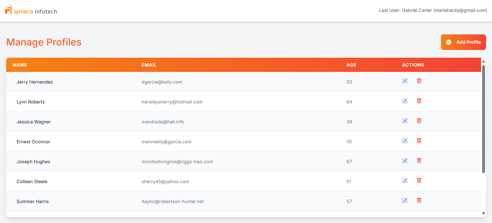
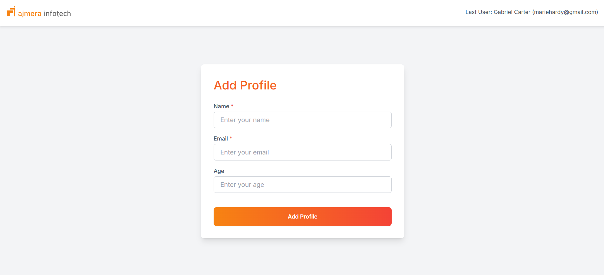
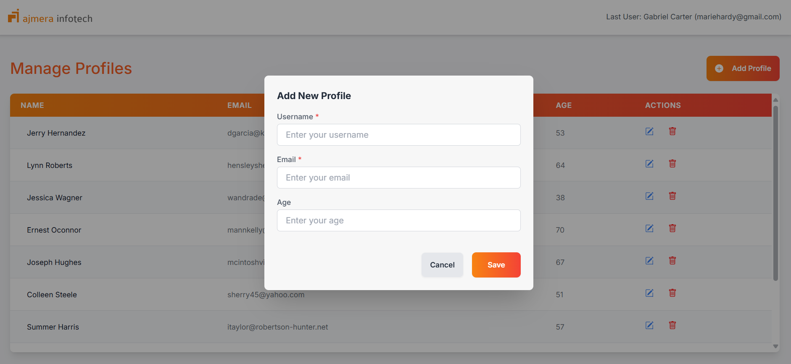
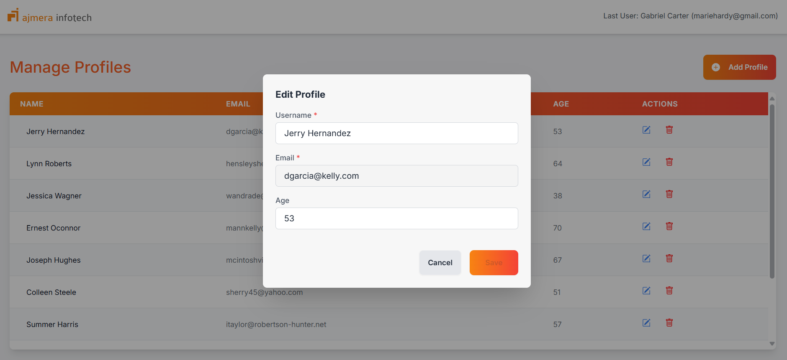
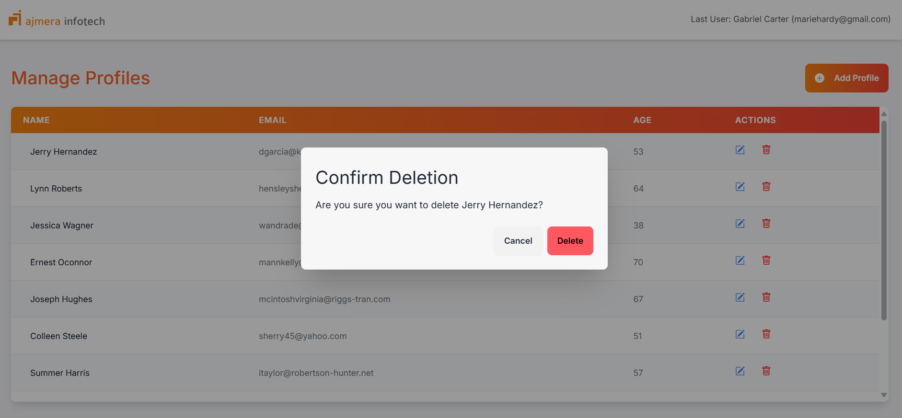

# Profile Management Demo

Profiles List Demo is a React-based application that allows users to create, view and manage profiles. This demo app demonstrates effective handling of user profiles, incorporating features such as form validation, data persistence, and smooth navigation.

## Features

- **Profile Creation**: Users can fill out their name, email, and age to create a profile. The form includes validation to ensure correct data entry.
- **Profiles List**: View all saved profiles in a list format.
- **Profile Update**: Users can update existing profiles with new information.
- **Routing**: Utilizes React Router for navigating between profile creation, viewing, and listing profiles.
- **Data Persistence**: Profile data is stored in local storage to persist across page refreshes.
- **State Management**: Global state for profile data is handled using React Context API.
- **Error Handling**: Displays proper messages for form validation errors or failed API requests.
- **Responsive Design**: Optimized for both desktop and mobile screens.

## Prerequisites

Before you begin, ensure you have the following installed:

- **Node.js** (version >= 14.x.x) - [Node.js](https://nodejs.org/)
- **npm** (version >= 6.x.x) - [npm](https://www.npmjs.com/get-npm)

## Getting Started

1. Clone the repository:

   ```bash
   git clone git@github.com:KASMI7/profile-management-app.git
   ```

2. Navigate to the project directory:

   ```bash
   cd profile-management-app
   ```

3. Install the required dependencies:

   ```bash
   npm install
   ```

4. Set Up Environment Variables
   To configure the API URLs, create a `.env` file in the project root and add the following environment variable:

```bash
REACT_APP_API_URL=http://localhost:3001
```

### 5. Start the development server:

- In the terminal, run the following command to start the React development server:

  ```bash
  npm start
  ```

- This will launch the React app at [http://localhost:3000](http://localhost:3000). At the same time, JSON server will run on [http://localhost:3001](http://localhost:3001) for API functionality.

- **React app:** [http://localhost:3000](http://localhost:3000)
- **JSON server:** [http://localhost:3001](http://localhost:3001)

- Once the development server is running, open your browser and navigate to `http://localhost:3000` to view the app.

### 5. Project Structure

```bash
profile-management-demo/
│
├── public/
│   └── assets/                # Static assets such as images and logos
│
├── src/
│   ├── components/            # Reusable components (e.g., ProfileForm, ProfileList)
│   ├── context/               # React Context API setup for global state management
│   ├── views/                 # Main pages (ProfileCreation, ProfilesList)
│   ├── services.tsx              # API service handlers
│   └── App.tsx                # Main app component
│
├── .env                       # Environment variables file
├── README.md                  # Project documentation
├── package.json               # Project dependencies and scripts
└── tsconfig.json              # TypeScript configuration
```

### Key Points:

1. **Profile List Screenshot**:
   Add this to showcase the profile listing UI in your app:
   ```markdown
   
   
   
   
   
   ```

### License

This project is licensed under the MIT License. See the [LICENSE](LICENSE) file for details.
